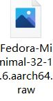
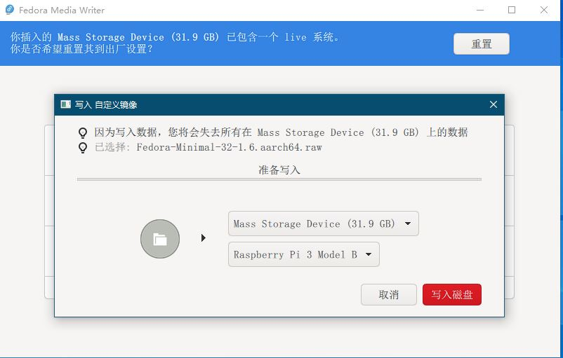
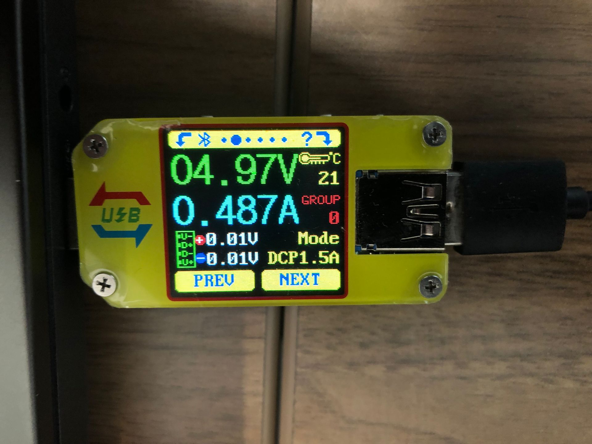
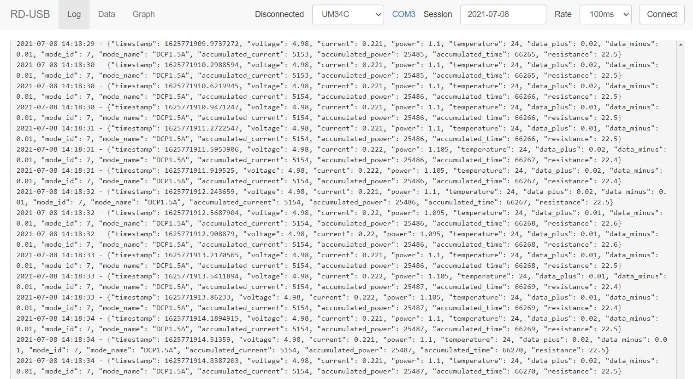
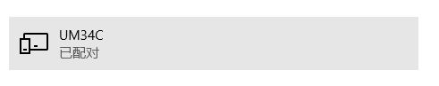
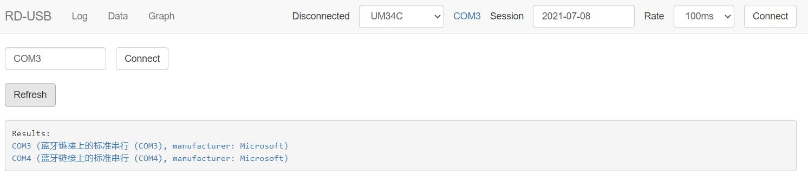
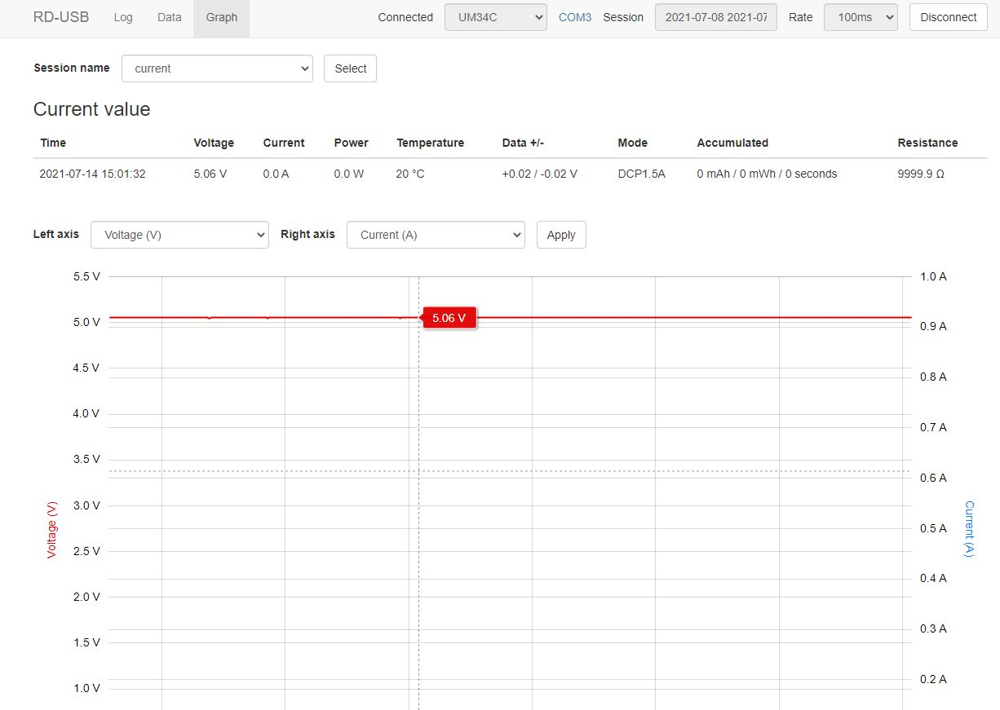
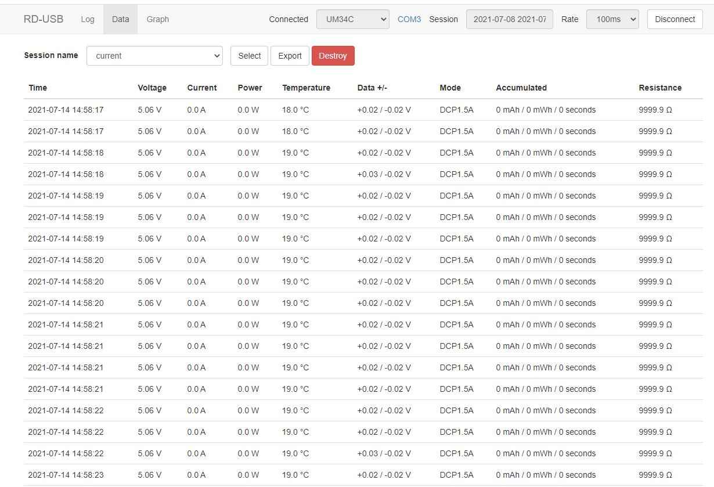
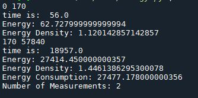

Depolying LPCV environment on Raspberry Pi 3 +
===================================================
  
## Installing Fedora OS with Anaconda on Raspberry Pi   
  
- Download Fedora 32 minimal Image from the web <https://fedoraproject.org/w/index.php?title=Architectures/ARM/Raspberry_Pi&oldid=580665>. Fedora 32 minial consumes the least energy on Raspberry Pi.  

- Download FedoraMediaWriter.exe and install on your PC, insert a micro-SD card, then run FedoraMediaWriter to initialze fedora 32 OS in micro-SD card.   

- Insert initialized micro-SD card to Raspberry Pi, turn on the Pi. You will see fedora initial configure. After setting up necessary configures, you need to access a WiFi to enable your Pi's network to run well. You can use these commands to access a WiFi network.  
```
$ nmcli radio
$ nmcli device
$ nmcli device wifi rescan
$ nmcli device wifi list
$ nmcli device wifi connect SSID password PWD  
```
Now it's time to install anaconda on your Fedora OS. **DO NOT** use Anaconda command to install it, your Pi might crash down. Instead, use this command to install miniconda.  
```
$ yum install conda
```
## Deploy deep learning environment with Anaconda
- Because Pi is not a x86_64 architecture, traditional installation method on virtual environment is not suitable here. We firstly need to install virtualenv package.  
```
$ pip install virtualenv
```
- We need a new folder to set up our virtual environment.
```
$ mkdir myproject
$ cd myproject
```
- Then we create a ***lpcv*** virtual environment including system packages.  
```
$ virtualenv --system-site-packages lpcv
$ source lpcv/bin/activate
```
- Now you can install required python packages in ***lpcv*** environment through pip. 
**SPECIAL:** pandas package could not be install by pip, your Pi will stop when running setup.py. 
```
$ dnf install python3-pandas
```
- Run this command under root user to install pandas packages.
## Measure model eneregy with Power Meter
- Here we use Ruideng power meter to measure the energy consumption of our deep model. The USB port need to be inserted to power supply, and the micro-USB is to power Pi. The screen will show the voltage-currency detail when you start power meter.

- There are two methods to export voltage-currency recording file. The first is to download official app(Chinese version). Here we recommend you to choose the second method.  
```
$ git clone rd-usb
$ cd rd-usb
```
- Change webapp/backend.py 206 line to your store path, then run  
```
$ python web.py
```
- The python file will automaticly open a website like this:  

- To link to the power meter, you need to turn on the bluetooth on your PC, and search um34c

- Ready to link um34c, click the blue COM3 button(the first time might be setup), and click COM3(manufacturer: Microsoft)  

- Connecting to um34c, you will see a dynamic graph recording and data stream recording on the web.


- The data.csv( store path can be changed as the above's instruction) will store all these data when you start to record.  
## Calculate energy consumption
- Change file path in energy.py, run  
```
$ python energy.py
```
- The results will show in thie console.



	 
